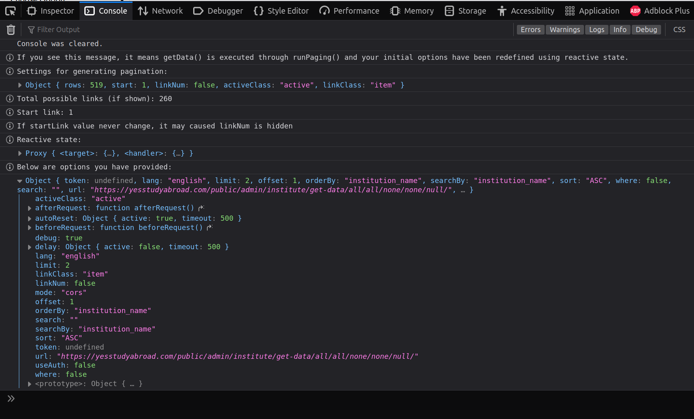
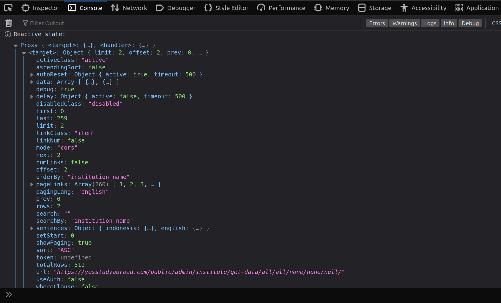

# New in version 3.x
## Fully-typed Core
SSPaging core functionality has been rewritten using Typescript, meaning it now provides code completion and better error detection.
## Unified Version
In version 2, the Composition API and Pinia version are separated source code and have different way to access the state. In version 3, both version now share the same source code. The Pinia version gets the same way as Composition API to work. This change affect the way to access SSPaging state in Pinia from (for example) `paging.rows` into `paging.state.rows`. With this change, SSPaging will have more consistent source code and faster updates release.
## Console Debugging
Version 3 provides debugging via browser console. Make it easy to see options or settings that have been provided and how SSPaging processing data in the background. With this simple feature, you can see what is happening when working with SSPaging. To activate this feature, you have to set `debug` option in `getData()` to `true`.  

 

## Bug Fixes and Improvements
Version 3, as in commonly major updates provides some bug fixes and improvements for both SSPaging core and components.