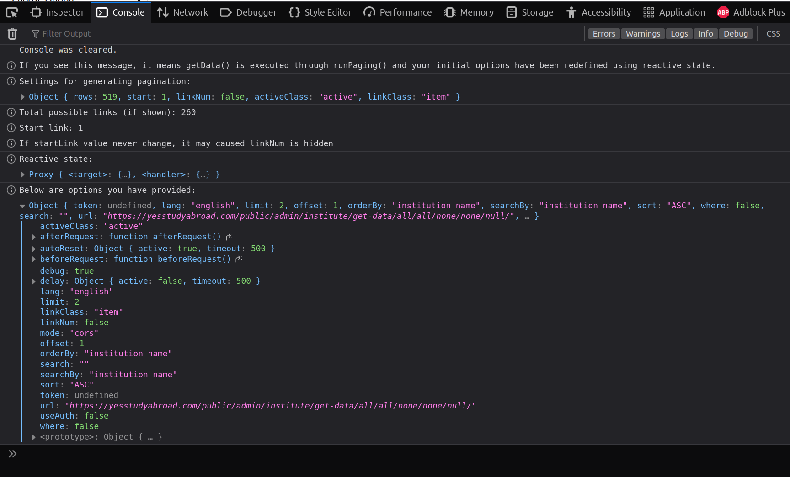
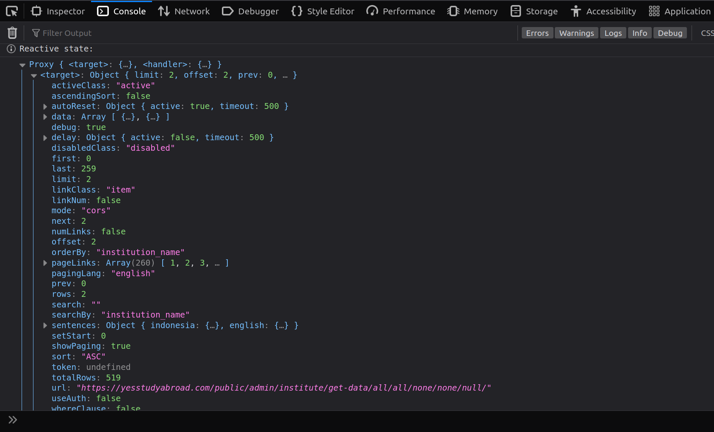

# New in version 3.x

## Fully-typed Core  
The core functionality of SSPaging has been rewritten using TypeScript, offering better code completion and error detection.

## Unified Version  
In version 2, the Composition API and Pinia versions had separate source codes and different methods for accessing the state. In version 3, both versions now share the same source code. The Pinia version now works the same way as the Composition API. This change affects how you access SSPaging state in Pinia, for example, changing from `paging.rows` to `paging.state.rows`. This unification results in a more consistent source code and faster updates.

## Console Debugging  
Version 3 introduces debugging via the browser console, making it easier to view the options or settings provided and see how SSPaging processes data in the background. With this feature, you can observe what’s happening while working with SSPaging. To enable debugging, simply set the `debug` option in `getData()` to `true`.  
   
  
   

## New state: `rawResponse`  
One of the challenges in previous versions of SSPaging was its inability to provide a complete response from the server. This meant that if you needed to include additional data while loading pagination data, you had to create a new route and make another request from your Vue.js code. In the current version, we've introduced a new state called `rawResponse`, which allows you to access the full response from the server.

## HTTP Header Options  
You can now pass options such as `limit`, `offset`, `orderBy`, and `sort` through HTTP request headers. This allows you to simplify your URL pattern by removing these options from the URL and instead passing them in the request headers. This improvement makes the URL cleaner and more flexible while maintaining the same pagination functionality.

## Cleaner URLs with POST Method

Starting from version **3.0.2**, SSPaging now supports making requests using the **POST method**, allowing for a much cleaner and more flexible URL structure.

## Bug Fixes and Improvements  
As expected with major updates, version 3 includes various bug fixes and improvements for both the SSPaging core and its components.
